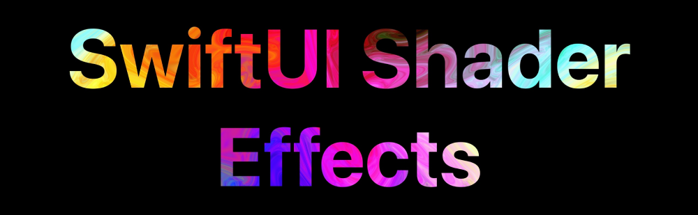

# SwiftUI Shader Effects

Welcome to the Metal Shader Effects for SwiftUI project! This is an open-source project where I create various Metal Shader effects specifically designed for SwiftUI applications. 

## About This Project

I work on this project in my free time, adding new effects whenever I find the time to code more. As I am just starting out in iOS programming, please bear with me as I learn and improve along the way.

## Current Effects

<table>
  <tr>
    <th>Color Mix Effect View</th>
    <th>Infinite Loop Loader</th>
  </tr>
  <tr>
    <td>
      

        <video src="https://github.com/GrishTad/ShaderEffects/assets/29206404/04f23715-cdb6-4cb5-ae85-0fe2fe7561f5" width="50%" autoplay muted loop></video>
      

    </td>
    <td>
      

        <video src="https://github.com/GrishTad/SwiftUI-Shader-Effects/assets/29206404/3e40d2dd-e2ab-4ed7-8dde-b1303d955947" width="50%" autoplay muted loop></video>
      

    </td>
  </tr>
</table>

## Buy Me a Coffee

If you like what I’m doing and want to show your appreciation, you can buy me a coffee!

## License

This project is licensed under the MIT License - see the [LICENSE](LICENSE) file for details.

## Contact

If you have any questions or suggestions, feel free to open an issue or reach out to me directly.

Thank you for your support!
